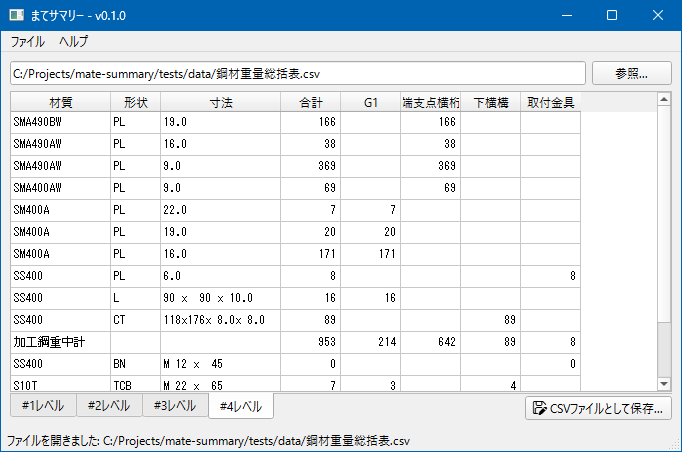

# まてサマリー: JIP-まてりある総括表変換ツール



JIP-まてりあるで出力した総括表CSVデータを読み込み、階層別に整理した総括表に変換します。

## 主な機能

- CSVファイルを読み込み、総括表データを表示
- 階層レベル毎に変換結果をプレビュー表示
- コマンドライン引数によるCSVファイル読み込みに対応

## 使用方法

1. [Releases](https://github.com/tamaohome/mate-summary/releases) より最新リリースのZIPファイルをダウンロードします。

2. ZIP を任意のフォルダに展開して `MateSummary.exe` を起動します。

### 操作手順

1. アプリを起動します。
2. 画面のファイル選択からCSVを開きます。
3. 階層レベル1〜4の総括表を確認します。
4. 必要に応じて「名前を付けて保存」でCSVを書き出します。

## 仕様

- 以下のCSVファイルに対応しています。
  - `鋼材重量総括表.csv`
  - `ボルト本数総括表(工場).csv`
  - `ボルト本数総括表(現場).csv`
  - `メッキ総括表.csv`
  - `部材長さ総括表.csv`

## ビルド方法（開発者向け）

1. `uv` を導入します。

2. 以下のコマンドで依存関係をインストールします。

```pwsh
uv sync
```

3. 以下のコマンドでビルドを開始します。

```pwsh
uv run pyinstaller mate-summary.spec
```
